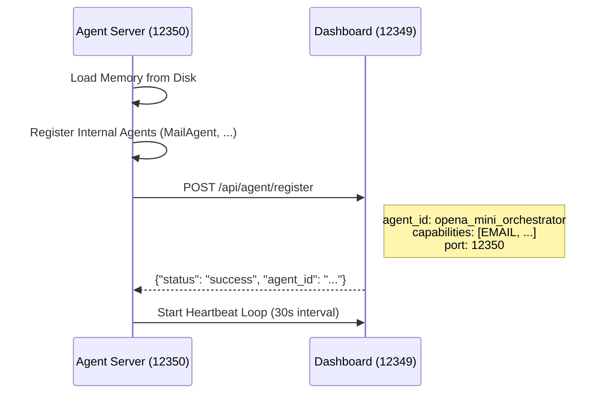
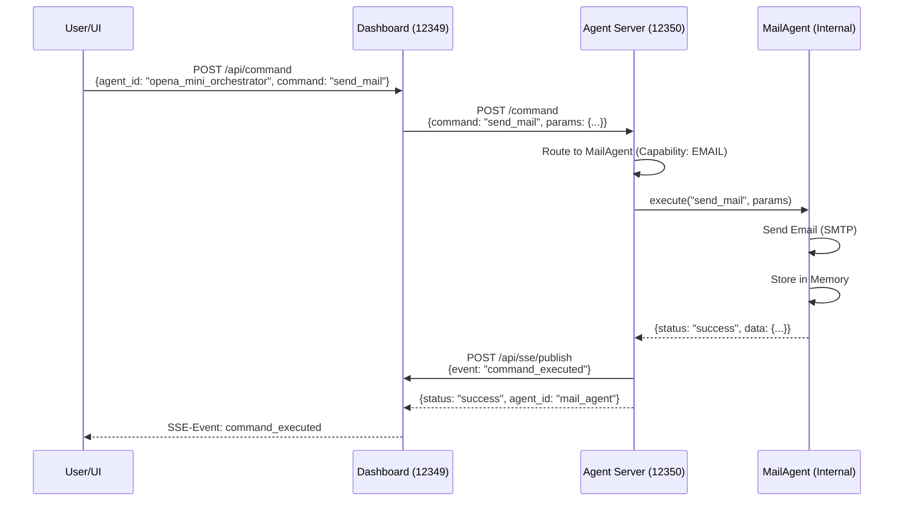
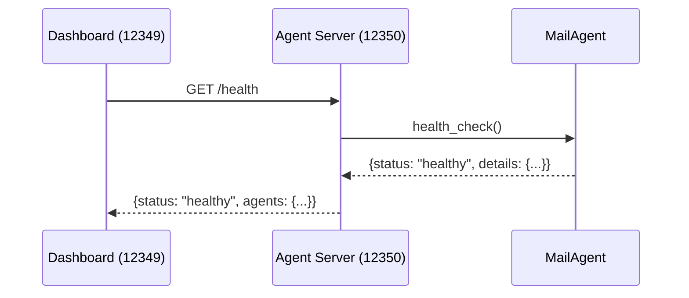

# 🏗️ Mini-Orchestrator Architektur

## Übersicht

Der **Mini-Orchestrator** (`agent_server`) ist ein **integriertes Subsystem** des ELION Hyper-Dashboards.

### Zielsetzung

> **"Keine neuen Systeme erfinden, sondern vorhandene integrieren."**

- ✅ Dashboard (opena19) bleibt **Top-Level-Orchestrator**
- ✅ Mini-Orchestrator ist **registrierter Agent** beim Dashboard (Port 12350)
- ✅ Interne Agents sind **private Worker**, nicht direkt von außen erreichbar
- ✅ Expandierbar ohne große System-Umbauten

---

## Systemarchitektur

```
┌─────────────────────────────────────────────────────────────┐
│              ELION Hyper-Dashboard (opena19)                 │
│              Port 12349 - Top-Level-Orchestrator             │
├─────────────────────────────────────────────────────────────┤
│  - Agent Registry                                            │
│  - SSE Bus (UI-Updates)                                      │
│  - Security (JWT, Bearer Token)                              │
│  - Monitoring (Background Poller)                            │
│  - Knowledgebase API                                         │
└────────────┬────────────────────────────────────────────────┘
             │
             │ Registration + Commands + Status
             │
             ▼
┌─────────────────────────────────────────────────────────────┐
│        Mini-Orchestrator (agent_server)                      │
│        Port 12350 - opena_mini_orchestrator                  │
├─────────────────────────────────────────────────────────────┤
│                                                               │
│  ┌──────────────────────────────────────────────────────┐  │
│  │           AgentManager (Registry)                     │  │
│  │  - Agent Lifecycle (init, shutdown)                   │  │
│  │  - Command Routing (by ID or Capability)             │  │
│  │  - Health Monitoring                                  │  │
│  └─────────────┬────────────────────────────────────────┘  │
│                │                                             │
│  ┌─────────────┴────────────────────────────────────────┐  │
│  │         MemorySystem (Shared Storage)                 │  │
│  │  - In-Memory Store                                    │  │
│  │  - File-based Persistence                             │  │
│  │  - Agent-isolated Namespaces                          │  │
│  │  - TTL Support                                        │  │
│  └──────────────────────────────────────────────────────┘  │
│                                                               │
│  ┌──────────────────────────────────────────────────────┐  │
│  │        AgentAPIClient (Dashboard Connector)           │  │
│  │  - Registration beim Dashboard                        │  │
│  │  - Status Updates + Heartbeat                         │  │
│  │  - SSE-Event Publishing                               │  │
│  │  - Command Forwarding                                 │  │
│  └──────────────────────────────────────────────────────┘  │
│                                                               │
│  ┌──────────────────────────────────────────────────────┐  │
│  │           Internal Agents (Workers)                   │  │
│  ├──────────────────────────────────────────────────────┤  │
│  │  MailAgent          (Capability: EMAIL)               │  │
│  │  BrowserAgent       (Capability: BROWSER) [TODO]      │  │
│  │  WorkflowAgent      (Capability: WORKFLOW) [TODO]     │  │
│  │  FileSystemAgent    (Capability: FILESYSTEM) [TODO]   │  │
│  │  ...                (expandierbar)                    │  │
│  └──────────────────────────────────────────────────────┘  │
│                                                               │
└───────────────────────────────────────────────────────────────┘
```

---

## Dateien & Verantwortlichkeiten

### Core-Module

| Datei                     | Verantwortlich für                                 | Zeilen | Status |
| ------------------------- | -------------------------------------------------- | ------ | ------ |
| `agent_server.py`         | FastAPI Entry-Point, Startup, Shutdown, API-Routes | ~320   | ✅     |
| `agents/agent_base.py`    | Basisklasse für alle Agents (Interface)            | ~180   | ✅     |
| `agents/agent_manager.py` | Registry, Lifecycle, Command-Routing, Health       | ~280   | ✅     |
| `agents/memory_system.py` | Shared Storage, Persistence, TTL                   | ~330   | ✅     |
| `agents/agent_api.py`     | HTTP-Client zum Dashboard (Registration, SSE)      | ~310   | ✅     |

### Implementations

| Datei                                      | Agent         | Capabilities | Status        |
| ------------------------------------------ | ------------- | ------------ | ------------- |
| `agents/implementations/mail_agent.py`     | MailAgent     | EMAIL        | ✅ (Beispiel) |
| `agents/implementations/browser_agent.py`  | BrowserAgent  | BROWSER      | ⏳ TODO       |
| `agents/implementations/workflow_agent.py` | WorkflowAgent | WORKFLOW     | ⏳ TODO       |

### Infrastruktur

| Datei                               | Zweck                       |
| ----------------------------------- | --------------------------- |
| `bin/start_agent_server.sh`         | Startup-Skript (Port 12350) |
| `docs/AGENT_SERVER_ARCHITECTURE.md` | Diese Datei                 |

---

## Kommunikationsfluss

### 1️⃣ **Startup: Registration beim Dashboard**



### 2️⃣ **Command Execution: Dashboard → Mini-Orchestrator → Internal Agent**



### 3️⃣ **Health-Check: Dashboard → Mini-Orchestrator**



---

## API-Endpoints (Mini-Orchestrator)

### `GET /health`

**Response:**

```json
{
  "status": "healthy|degraded|unhealthy",
  "timestamp": "2025-11-21T12:00:00Z",
  "details": {
    "overall": "healthy",
    "agents": {
      "mail_agent": {
        "status": "healthy",
        "details": {...}
      }
    },
    "summary": {
      "total": 1,
      "healthy": 1,
      "degraded": 0,
      "unhealthy": 0
    }
  }
}
```

### `POST /command`

**Request:**

```json
{
  "command": "send_mail",
  "params": {
    "to": "user@example.com",
    "subject": "Test",
    "body": "Hello World"
  },
  "agent_id": "mail_agent", // Optional: expliziter Agent
  "capability": "email" // Optional: Auto-Routing
}
```

**Response:**

```json
{
  "status": "success",
  "data": {
    "mail_id": "mail_1234567890",
    "to": "user@example.com",
    "sent_at": "2025-11-21T12:00:00Z"
  },
  "error": null,
  "agent_id": "mail_agent"
}
```

### `GET /agents`

**Response:**

```json
[
  {
    "agent_id": "mail_agent",
    "status": "ready",
    "capabilities": ["email"],
    "metadata": {
      "created_at": "2025-11-21T10:00:00Z",
      "version": "1.0.0"
    }
  }
]
```

### `GET /stats`

**Response:**

```json
{
  "agent_manager": {
    "total_agents": 1,
    "by_status": {"ready": 1},
    "by_capability": {"email": 1},
    "agent_ids": ["mail_agent"]
  },
  "memory_system": {
    "total_agents": 1,
    "total_entries": 5,
    "agents": {
      "mail_agent": {
        "entries": 5,
        "keys": ["sent_mail_123", "last_init", ...]
      }
    }
  },
  "timestamp": "2025-11-21T12:00:00Z"
}
```

---

## Integration mit Dashboard

### Dashboard muss **nichts ändern**:

- ✅ Standard-Agent-Registration via `/api/agent/register` (bereits vorhanden)
- ✅ Standard-Command-Routing via `/api/command` (bereits vorhanden)
- ✅ SSE-Events via `/api/sse/publish` (bereits vorhanden)

### Dashboard sieht Mini-Orchestrator als:

```json
{
  "agent_id": "opena_mini_orchestrator",
  "endpoint": "http://127.0.0.1:12350",
  "status": "online",
  "capabilities": ["email", "browser", "workflow"],
  "metadata": {
    "agent_count": 3,
    "version": "1.0.0"
  }
}
```

### Sub-Agents (MailAgent, BrowserAgent) sind:

- ❌ **Nicht direkt** im Dashboard registriert
- ✅ **Nur intern** sichtbar via `/agents` oder `/stats` des Mini-Orchestrators
- ✅ **Dashboard-UI** kann Sub-Status optional anzeigen (Drill-Down)

---

## Erweiterung: Neue Agents hinzufügen

### Schritt 1: Agent-Klasse erstellen

```python
# agents/implementations/browser_agent.py
from ..agent_base import AgentBase, AgentCapability

class BrowserAgent(AgentBase):
    def __init__(self, memory_system=None):
        super().__init__(
            agent_id="browser_agent",
            capabilities=[AgentCapability.BROWSER],
            memory_system=memory_system
        )

    async def execute(self, command: str, params: dict):
        if command == "browse_url":
            return await self._browse_url(params)
        # ...

    async def health_check(self):
        return {"status": "healthy"}
```

### Schritt 2: In `agent_server.py` registrieren

```python
# In startup_event():
from agents.implementations.browser_agent import BrowserAgent

browser_agent = BrowserAgent(memory_system=memory_system)
await agent_manager.register_agent(browser_agent)
```

✅ **Fertig!** Agent ist sofort verfügbar.

---

## Best Practices

### ✅ **DO:**

- Agents über `AgentManager` registrieren
- Memory-System für Agent-State nutzen
- Capabilities korrekt deklarieren
- Health-Checks implementieren
- Errors sauber catchen & loggen
- SSE-Events für wichtige Actions publishen

### ❌ **DON'T:**

- Agents direkt beim Dashboard registrieren (nur Mini-Orchestrator selbst)
- Agents direkt von außen aufrufen (nur via Mini-Orchestrator)
- Hardcoded Configs (immer ENV-Vars nutzen)
- Memory-System umgehen (immer über `store_memory`/`retrieve_memory`)

---

## Deployment

### Lokal starten:

```bash
# Terminal 1: Dashboard starten
bin/start_all.sh  # Oder nur Dashboard: src/pkg/main_dashboard.py

# Terminal 2: Mini-Orchestrator starten
bin/start_agent_server.sh

# Prüfen
curl http://127.0.0.1:12350/health | jq .
curl http://127.0.0.1:12349/api/status/all | jq '.agents[] | select(.agent_id=="opena_mini_orchestrator")'
```

### Produktiv (Docker):

```dockerfile
# Dockerfile.agent_server
FROM python:3.13-slim
WORKDIR /app
COPY requirements.txt .
RUN pip install -r requirements.txt
COPY src/ src/
CMD ["python3", "-m", "uvicorn", "src.pkg.agent_server:app", "--host", "0.0.0.0", "--port", "12350"]
```

```yaml
# docker-compose.prod.yml
services:
  agent_server:
    build:
      context: .
      dockerfile: Dockerfile.agent_server
    ports:
      - "12350:12350"
    environment:
      - DASHBOARD_URL=http://dashboard:12349
      - BEARER_TOKEN=${BEARER_TOKEN}
    depends_on:
      - dashboard
```

---

## Monitoring & Debugging

### Logs:

```bash
# Agent Server Log
tail -f logs/agent_server.log

# Nohup Log (bei Hintergrund-Start)
tail -f logs/agent_server.nohup.log
```

### Health-Checks:

```bash
# Gesamtstatus
curl http://127.0.0.1:12350/health | jq .

# Alle Agents
curl http://127.0.0.1:12350/agents | jq .

# Statistiken
curl http://127.0.0.1:12350/stats | jq .
```

### Dashboard-Integration prüfen:

```bash
# Ist Mini-Orchestrator registriert?
curl http://127.0.0.1:12349/api/status/all | jq '.agents[] | select(.agent_id=="opena_mini_orchestrator")'

# Command an Mini-Orchestrator senden
curl -X POST http://127.0.0.1:12349/api/command \
  -H "Authorization: Bearer $BEARER_TOKEN" \
  -H "Content-Type: application/json" \
  -d '{
    "agent_id": "opena_mini_orchestrator",
    "command": "send_mail",
    "params": {"to": "test@example.com", "subject": "Test", "body": "Hello"}
  }' | jq .
```

---

## Zusammenfassung

| Komponente            | Rolle                      | Port  | Status       |
| --------------------- | -------------------------- | ----- | ------------ |
| **Dashboard**         | Top-Level-Orchestrator     | 12349 | ✅ Produktiv |
| **Mini-Orchestrator** | Registriertes Subsystem    | 12350 | ✅ Produktiv |
| **MailAgent**         | Interner Worker (EMAIL)    | -     | ✅ Beispiel  |
| **BrowserAgent**      | Interner Worker (BROWSER)  | -     | ⏳ TODO      |
| **WorkflowAgent**     | Interner Worker (WORKFLOW) | -     | ⏳ TODO      |

**Architektur-Prinzip:**

> Keine neuen Systeme erfinden. Vorhandene Systeme (Dashboard, agent_server) sauber integrieren.

✅ **Ziel erreicht:** Erweiterbar, wartbar, konform mit bestehender Architektur.
